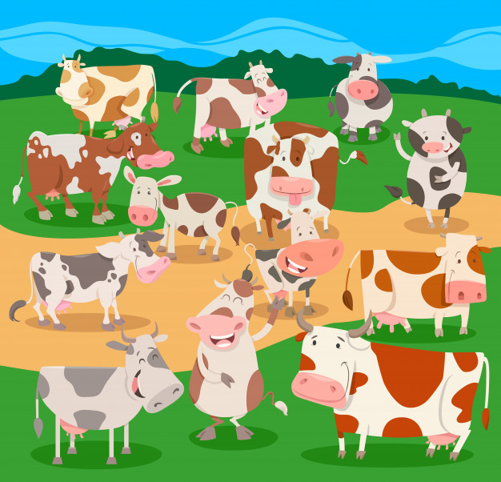

```{r setup, include=FALSE}
knitr::opts_chunk$set(echo = TRUE)
library(knitr)
```


  
<center>
{width=300px}
</center>

Nous avons préparé un google.form pour vous aider à définir votre scénario. Vous le trouverez à cette [adresse](https://forms.gle/RTF36fSzUB5ryzB58)

Ce document vous fournira des détails sur  les différents paramètres à choisir. 


## **Introduction**

La première question à se poser est "Quelle hypothèse je veux tester?"
A partir de là, l'idée est de définir plusieurs scenarios permettant de répondre à cette question. Un scenario seul ne sera pas intéressant, il faut toujours avoir un scenario de référence auquel se comparer. 

## **En pratique**

Il vous faudra remplir UN google form par scénario. Ceci pourra être pénible si vous envisager plus de 5  scénarios ou si vous voulez changer juste un paramètre (un réseau d'échange par exemple ou une taille de troupeau).
Dans ce cas, vous pouvez accéder aux réponses de votre googleform  sous forme de tableau excel [ici](https://docs.google.com/spreadsheets/d/188Sls7V_rV88Rlz9Pd2lA0ym15HIZL6_eLkvZl1Ddbc/edit?usp=sharing). Vous ne pourrez pas éditer ce fichier mais vous devrier pouvoir copier la ligne qui correspond à votre scenario, la copier pour la modifier autant de fois que vous voulez et nous  renvoyer un fichier excel.  


Afin de simuler des scenarios d'échanges et leur influence sur l'hétérogénéité génétique des animaux nous vous  proposons de spécifier les paramètres suivants :   


## **A propos des animaux**


  - **Carrière de reproduction**
      * `career.ram` et `career.ewe`  : âge maximal de reproduction pour chaque sexe
      * `age.repro.ram` et `age.repro.ewe` : aĝe minimal de reproduction pour chaque sexe
      

  
```{r}
career.ram = 8
career.ewe = 8 
age.repro.ewe = 3
age.repro.ram  = 1
``` 
  
<center>
{width=100px}
</center>


  - **Taux de reproduction**
      * Pour une taille de portée, fournir la probabilité d'occurrence
  
```{r}
rate.repro = as.data.frame(cbind(c(0,1,2),c(0.1,0.8,0.1)))
names(rate.repro) = c('nb.lambs','probability')
kable(rate.repro)
```

  
<center>
{width=100px}
</center>

## **A propos des troupeaux**


  - **Nombre de troupeaux étudiés `n.herds`**

```{r}
n.herds  = 10
```
<center>
{width=100px}
</center>


  - **Compositions de chaque troupeaux `n.ewe`, `n.ram` **
  
  la composition peut être la même dans tous les troupeaux. On peut aussi introduire des déséquilibres. 

```{r}
param.by.herd <- list(n.ram = 2,
                      n.ewe = 40)
```

<center>
{width=100px}
</center>


## **Echanges possibles**

Les différents échanges sont encodés dans des réseaux ou de façon équivalentes dans des matrices de taille `n.herds` x`n.herds`. 
Les échanges entre troupeaux peuvent arriver à 3 niveaux : 

  - au moment du remplacement des mâles trop vieux :  `ram.for.replace` 
  - au moment du remplacement des femelles trop vieilles : `ewe.for.replace`
  - au moment de la reproduction (les pères potentiels d'autres troupeaux sont amenés pour la reproduction et mélangés au troupeau) : `ram.for.repro`
    


**Parmi les choix possibles** *pour chaque réseau* : 

  - Seulement des self-loop : aucun échange. Autrement dit, on remplace avec les agneaux nés dans le troupeau, les pères sont  les mâles du troupeau. 
  - Réseau en étoile : un des troupeaux sert de "réservoir" et approvisionne les autres quand il y a des manquants. 
  - Réseau aléatoire. Fixer le nombre de connexions moyennes par troupeau. 
  -  Chaîne 1-> 2 -> 3 etc... 

  
<center>
{width=100px}  {width=100px}  {width=100px} 
</center>


**Remarques** : 

  - Mettre des échanges partout risque d'entraîne beaucoup de confusion. 
  

## **Accidents**

On peut simuler la perte partielle d'un ou plusieurs  troupeaux du réseau. Dans ce cas, il faudra choisir le nombre de troupeaux concernés et le pourcentage de perte.  


<center>
Vous pouvez maintenant préparer vos  [scenarii](https://forms.gle/RTF36fSzUB5ryzB58)
</center>

<center>
{width=300px} 
</center>


 
 