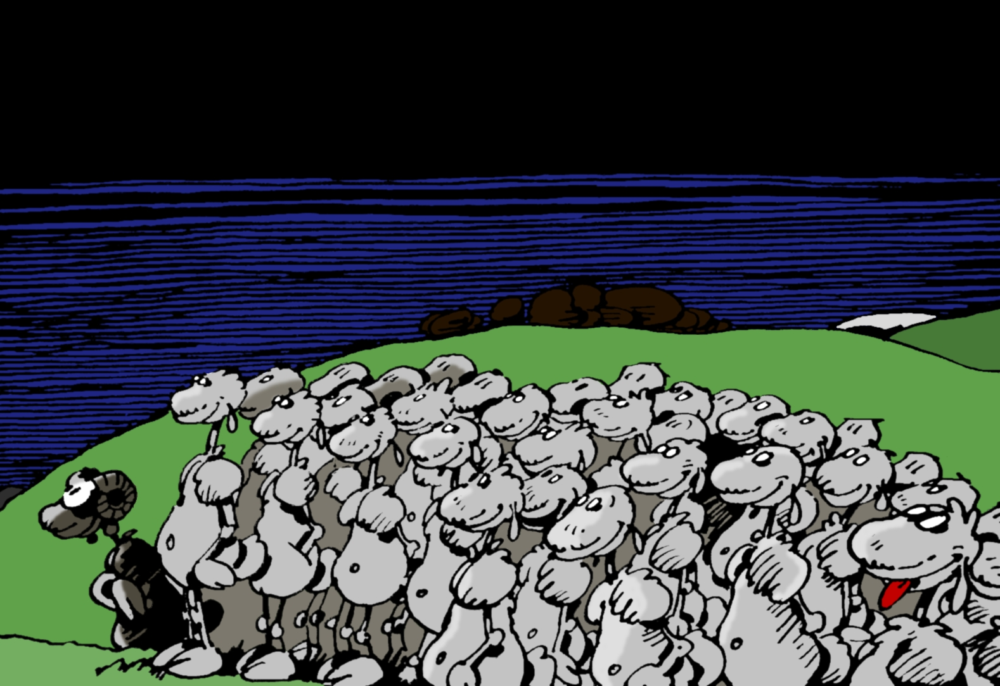
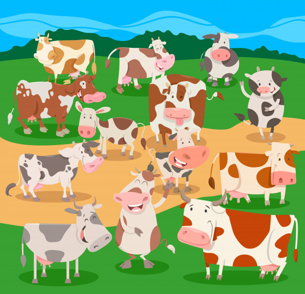

```{r setup, include=FALSE}
knitr::opts_chunk$set(echo = TRUE)
library(knitr)
```


  
<center>
{width=300px}
</center>

Nous avons préparé un google.form pour vous aider à définir votre scénario. 

Ce document vous fournira des détails sur  les différents paramètres à choisir. 


## **Introduction**

La première question à se poser est "Quelle hypothèse je veux tester?"
A partir de là, l'idée est de définir plusieurs scenarios permettant de répondre à cette question. Un scenario seul ne sera pas intéressant, il faut toujours avoir un scenario de référence auquel se comparer. 

## **En pratique**

Voici le lien  du  [google.form](https://forms.gle/RTF36fSzUB5ryzB58)
Il vous faudra remplir **UN google form par scénario**. Ceci pourra être pénible si vous envisager plus de 5  scénarios ou si vous voulez changer juste un paramètre (un réseau d'échange par exemple ou une taille de troupeau).
Dans ce cas, vous pouvez accéder aux réponses de votre googleform  sous forme de tableau excel [ici](https://docs.google.com/spreadsheets/d/188Sls7V_rV88Rlz9Pd2lA0ym15HIZL6_eLkvZl1Ddbc/edit?usp=sharing). Vous ne pourrez pas éditer ce fichier mais vous devriez pouvoir copier la ligne qui correspond à votre scenario, la copier pour la modifier autant de fois que vous voulez et nous  renvoyer un fichier excel du même format. **Merci de ne pas changer les noms des colonnes**.  


Afin de simuler des scenarios d'échanges et leur influence sur l'hétérogénéité génétique des animaux nous vous  proposons de spécifier les paramètres suivants :   


## **A propos des animaux**


  - **Carrière de reproduction**
      * `age.max.repro.ram` et `age.max.repro.ewe`  : âge maximal de reproduction pour chaque sexe
      * `age.min.repro.ram` et `age.min.repro.ewe` : aĝe minimal de reproduction pour chaque sexe
      

  
```{r}
age.max.repro.ram = 8
age.max.repro.ewe = 8 
age.min.repro.ewe = 3
age.min.repro.ram  = 1
``` 
  
<center>
{width=100px}
</center>


  - **Taux de reproduction**
      * Pour une taille de portée, fournir la probabilité d'occurrence
  
```{r}
rate.repro = as.data.frame(cbind(c(0,1,2),c(0.1,0.8,0.1)))
names(rate.repro) = c('nb.lambs','probability')
kable(rate.repro)
```

  
<center>
{width=100px}
</center>

## **A propos des troupeaux**


  - **Nombre de troupeaux étudiés `n.herds`**

```{r}
n.herds  = 10
```
<center>
{width=100px}
</center>


  - **Compositions de chaque troupeaux `n.ewe`, `n.ram` **
  
  la composition peut être la même dans tous les troupeaux. On peut aussi introduire des déséquilibres. 

```{r}
param.by.herd <- list(n.ram = 2,
                      n.ewe = 40)
```

<center>
{width=100px}
</center>


## **Circulation d'animaux**

La circulation d'animaux peut avoir lieu à plusieurs niveaux : 
      
  * *Au moment du remplacement de betes trop agées* : les mâles ou les femelles trop vieilles sont remplacés par des petits nés dans l'année.  Soit les petits sont pris dans le troupeau (pas de circulation), soit ils sont obtenus auprès d'autres éleveurs parmi les "contacts" de l'éleveur en question. 
      
  * *Les mâles peuvent circuler de façon spécifique*. On peut décider de limiter le temps passé par un mâle dans un troupeau donné `param.by.herd$career.ram <- 2`. Dans ce cas, au bout de `career.ram` ans passés dans un troupeau, les mâles sont reproposés à d'autres éleveurs qui en ont besoin (mâle ayant atteint la limite d'âge ou de temps dans le troupeau). Si on ne veut pas avoir ce genre de circulation, il suffit de mettre `param.by.herd$career.ram = param.by.herd$age.max.repro.ram`. 
      

Il faut donc définir trois réseaux d'échanges encodés dans des réseaux ou de façon équivalentes dans des matrices de taille `n.herds` x`n.herds`.  Les réseaux correspondant aux 3 échanges ci dessus sont nommés: 

  - `ram.circulation`

  - `ram.replace`

  - `ewe.replace` 

Les réseaux `ram.replace` et `ewe.replace` peuvent avoir des autoloops  i.e. les éleveurs peuvent remplacer les vieux par des jeunes nés dans le troupeau. Si sur une ligne $i$, l'individu $i$ a $n_i$ contacts alors chaque année on tire au hasard le troupeau qui fournira les bêtes nécéssaires parmi ces $n_i$. Les réseaux peuvent être pondérés. 
La circulation des males a lieu entre des troupeaux différents, donc `ram.circulation` n'a pas d'autoloop.  
 


**Parmi les choix possibles** *pour chaque réseau* : 

  - Seulement des self-loop : aucun échange. Autrement dit, on remplace avec les agneaux nés dans le troupeau, les pères sont  les mâles du troupeau. 
  - Réseau en étoile : un des troupeaux sert de "réservoir" et approvisionne les autres quand il y a des manquants. 
  - Réseau aléatoire. Fixer le nombre de connexions moyennes par troupeau. 
  -  Chaîne 1-> 2 -> 3 etc... 

  
<center>
{width=100px}  {width=100px}  {width=100px} 
</center>


**Remarques** : 

  - Mettre des échanges partout risque d'entraîner beaucoup de confusion d'effets. **Préférer  un seul réseau de circulation**.
  - La valeur par défaut d'un réseau est seulement des self-loop (pas d'échanges)
  

## **Accidents**

On peut simuler la perte partielle d'un ou plusieurs  troupeaux du réseau. Dans ce cas, il faudra choisir le nombre de troupeaux concernés et le pourcentage de perte.  


<center>
Vous pouvez maintenant préparer vos scnenarii  [à ce lien](https://forms.gle/RTF36fSzUB5ryzB58)
</center>

<center>
{width=300px} 
</center>


 
 