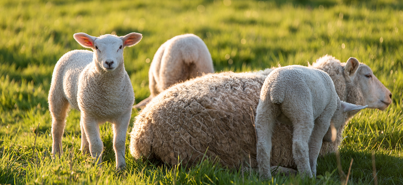

```{r setup, include=FALSE}
knitr::opts_chunk$set(echo = FALSE)
```

## Objectifs

{#id .class width=50% height=50%}


- Modéliser l'évolution conjointe de la composition de plusieurs troupeaux
- Prendre en compte un réseau d'échange d'animaux entre bergers
- Etudier l'influence de la structure de ce réseau sur la composition du troupeau (consanguinité par exemple)

- *Mission*:  Avoir un programme  R rapide, souple et facile à faire évoluer. 

## Hypothèses de travail : troupeaux

{#id .class width=50% height=50%}


- On considère $N$ ($10$?) troupeaux composés essentiellement de femelles (dans les exemples  :  40 femelles pour 2 mâles)
- Les troupeaux sont de taille constantes au cours du temps. 


## Hypothèses de travail : âges de reproduction


- Les mâles sont reproducteurs dès l'année suivant leur naissance
- Les femelles sont reproductrices au bout de "quelques" années (paramètre à régler)
- Mâles et femelles sont aptes à se reproduire jusqu'à un âge à fixer (propre aux mâles et femelles) : une fois l'âge passé, les animaux sont retirés du troupeau

- Les femelles ont entre 0 et 2 petits par ans (probabilité à définir)

## Hypothèses de travail : reproduction

- *Pour l'instant* : reproduction intra troupeau.
- *Si besoin* : codes prévus pour modéliser échange de mâles entre troupeaux au moment de la reproduction

        - selon un certain réseau d'échanges
        - de façon certaine ou aléatoire 

{#id .class width=50% height=50%}

## Hypothèses de travail : devenir des petits

- Les femelles trop vieilles sont remplacées par des petits femelles nées dans le troupeau, de façon à garder la taille du troupeau constante. 

        - Si une année, on n'a pas produit assez de petits femelles, 
        le manque sera compensé l'année suivante. 

- Quand le mâle atteint l'âge limite, il est remplacé par un petit mâle: 

        -  ce mâle est choisi parmi les autres troupeaux selon 
        un réseau d'échange fixé à l'avance et constant au cours 
        du temps.


## Mise en pratique : paramètres 

```{r cars, echo = TRUE}
n.herds = 10
param.default <- list(n.ram = 3,
                      n.ewe = 40,
                      age.max.repro.ram = 8,
                      age.max.repro.ewe = 8,
                      age.min.ram = 0,
                      age.min.ewe = 0,
                      age.min.repro.ewe = 3,
                      age.min.repro.ram = 1)
param.default$rate.repro = as.data.frame(cbind(c(0,1,2),c(0,1,0)))
names(param.default$rate.repro) = c('nb.lambs','probability')
param = lapply(1:n.herds,function(i) param.default)
```

## Simulation des descendances de troupeaux


Voir démo R. 

