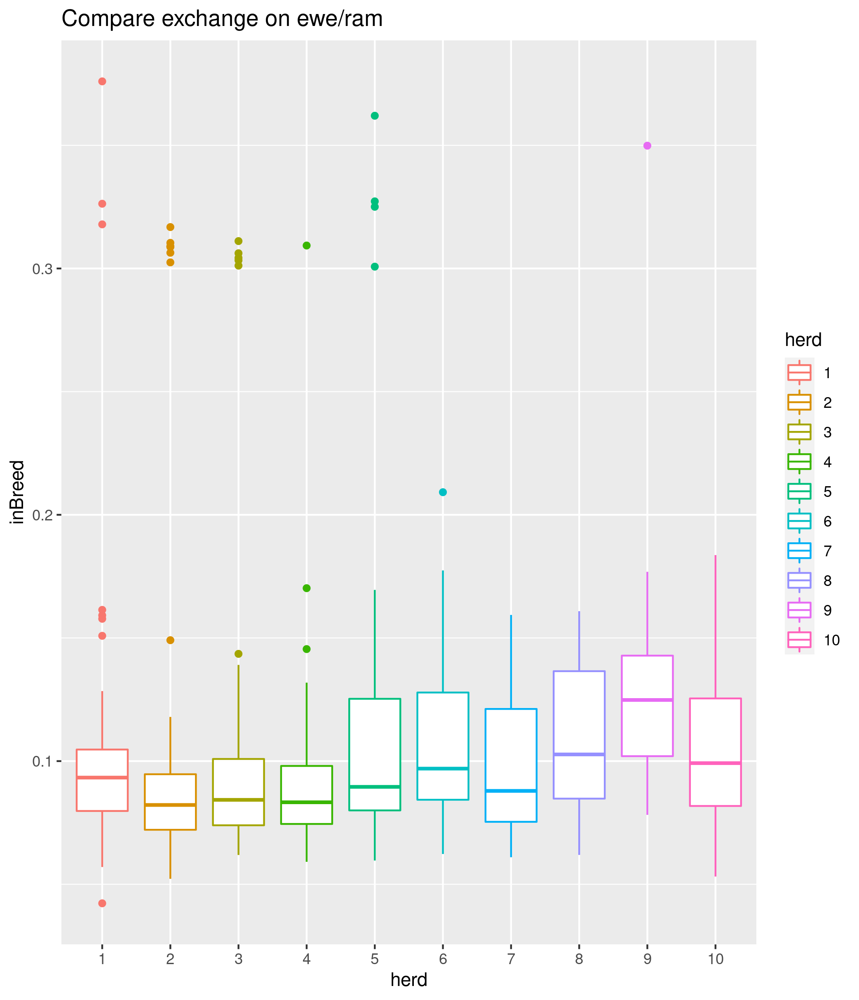
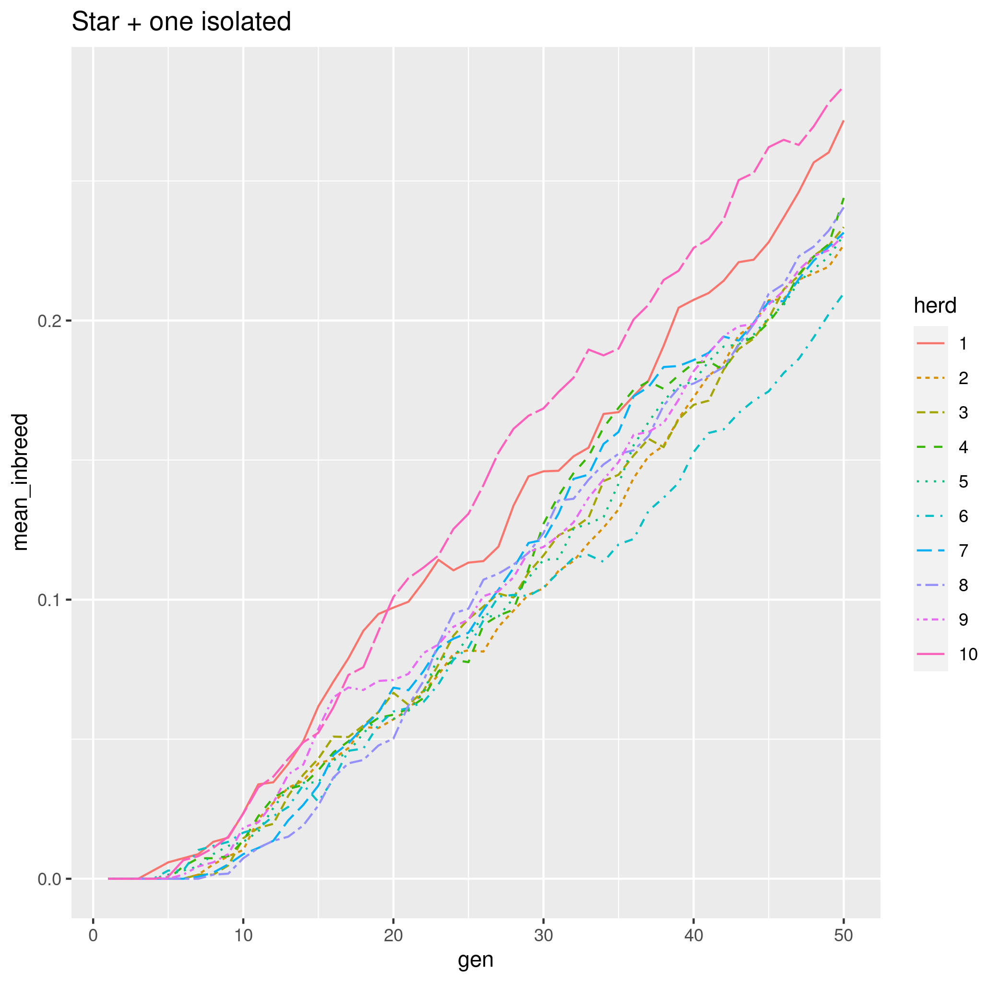

```{r setup, include=FALSE}
knitr::opts_chunk$set(echo = FALSE)
```

## Objectifs

{#id .class width=50% height=50%}


- Modéliser l'évolution conjointe de la composition de plusieurs troupeaux
- Prendre en compte ~~un~~ des réseaux d'échange d'animaux entre berger 
- Etudier l'influence de la structure de ce réseau sur la composition du troupeau (consanguinité par exemple)

- *Mission*:  Avoir un programme  R rapide  + **une application Shiny**, souple et facile à faire évoluer. 

## Hypothèses de travail : troupeaux

{#id .class width=50% height=50%}


- On considère $N$ (=10 ?) troupeaux composés essentiellement de femelles (dans les exemples  :  40 femelles pour 2 mâles)
- Les troupeaux sont de taille constantes au cours du temps. 


## Hypothèses de travail : âges de reproduction


- Les mâles sont reproducteurs dès l'année suivant leur naissance
- Les femelles sont reproductrices au bout de "quelques" années (paramètre à régler)
- Mâles et femelles sont aptes à se reproduire jusqu'à un âge à fixer (propre aux mâles et femelles) : une fois l'âge passé, les animaux sont retirés du troupeau

- Les femelles ont entre 0 et 2 petits par an  (probabilité à définir)

## Hypothèses de travail : reproduction

- *Avant* : introduction d'un réseau de partage de mâles pour la reproduction. Chaque année, les pères sont choisis dans **un** troupeau selon un réseau de reproduction 
- *Maintenant* : on contrôle le temps passé par un mâle au sein de chaque troupeau. 
   
```{r , eval= TRUE, echo = FALSE, message=FALSE }        
library(igraph)
set.seed(8)
E <-  erdos.renyi.game(10,0.05,loops = TRUE,directed=TRUE)
M <- as.matrix(get.adjacency(E))
ind <- c(which(rowSums(M)==0),5)
diag(M)[ind] <- 1
plot(graph_from_adjacency_matrix(t(M)))
```        
        
        
{#id .class width=50% height=50%}

## Hypothèses de travail : remplacement des femelles trop agées

~~Les femelles trop vieilles sont remplacées par des petites femelles nées dans le troupeau, de façon à garder la taille du troupeau constante.~~

- Les femelles trop vieilles sont remplacées par des petites femelles nées dans le troupeau ou chez des bergers selon un autre réseau (**2ème réseau**)

        - Si une année, on n'a pas produit assez de petits femelles, 
        le manque sera compensé l'année suivante. 


## Hypothèses de travail : remplacement des mâles trop agés


- Quand le mâle atteint l'âge limite, il est remplacé par un petit mâle: 

    -  ce mâle est choisi parmi les autres troupeaux selon 
        un réseau d'échange fixé à l'avance et constant au cours 
        du temps. **(3ème réseau)**


## Mise en pratique : paramètres 

```{r cars, echo = TRUE}
n.herds = 10
param.default <- list(n.ram = 3,
                      n.ewe = 40,
                      age.max.repro.ram = 8,
                      age.max.repro.ewe = 8,
                      age.min.ram = 0,
                      age.min.ewe = 0,
                      age.min.repro.ewe = 3,
                      age.min.repro.ram = 1)
param.default$rate.repro = as.data.frame(cbind(c(0,1,2),c(0,1,0)))
names(param.default$rate.repro) = c('nb.lambs','probability')
param = lapply(1:n.herds,function(i) param.default)
```

voir nouveau code

## Autre nouveauté

On peut suivre la consanguinité au cours du temps. 

{#id .class width=50% height=50%}

## Plusieurs troupeaux connectés: on suit la moyenne au cours du temps


{#id .class width=50% height=50%}

## Que faire après

  - Choisir des scénarios typiques. 
  - Imaginer des conditions
  - Fixer le plus de paramètres possibles et faire varier
  - Regarder d'autres indices (-> en cours avec l'aide de généticiens)
  - Nous : on s'occupe des simulations (=calibrer le nombre de fois où répéter l'expérience pour avoir un signal, choisir les outils de comparaisons)

