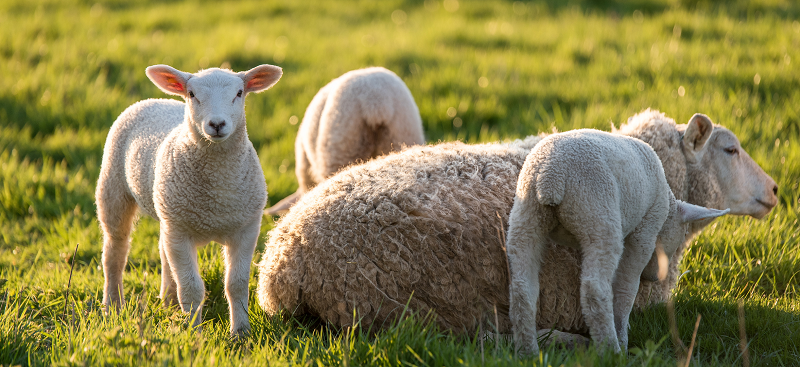
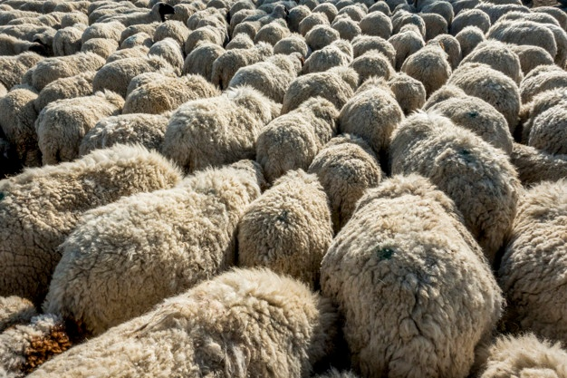
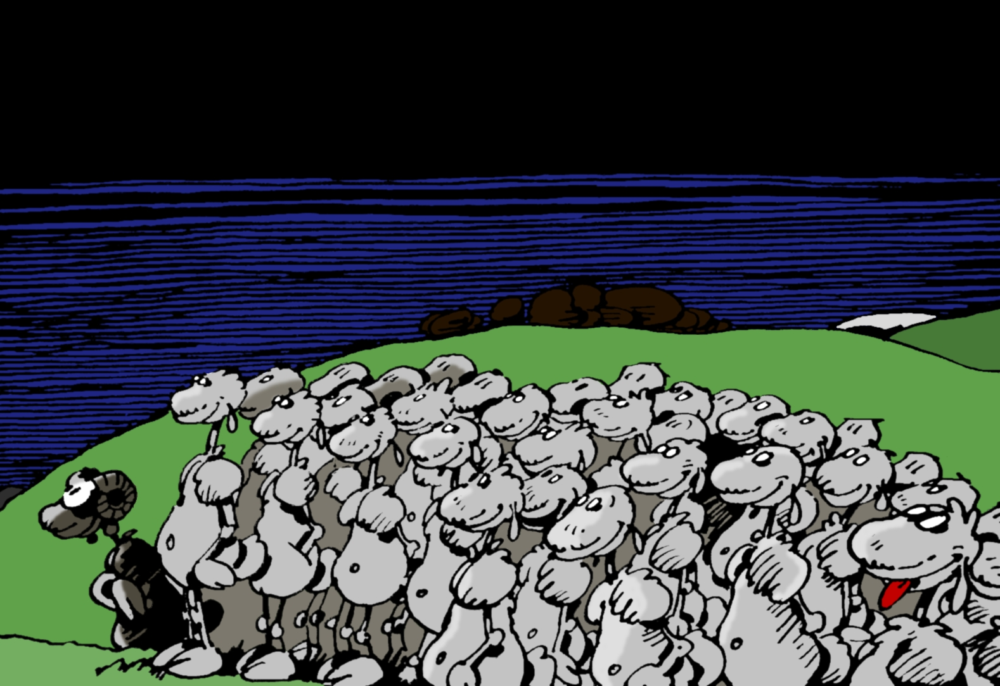

```{r setup, include=FALSE}
knitr::opts_chunk$set(echo = FALSE)
```

## Objectifs

{#id .class width=50% height=50%}


- Modéliser l'évolution conjointe de la composition de plusieurs troupeaux
- Prendre en compte un (ou plusieurs) réseaux d'échange d'animaux entre bergers 
- Etudier l'influence de la structure de ce réseau sur la composition du troupeau (consanguinité, kinship...)

- *Mission*:  Avoir un programme  R rapide  + **une application Shiny**, souple et facile à faire évoluer. 

## Hypothèses de travail : troupeaux

{#id .class width=50% height=50%}


- On considère $N$ ($=10$ ?) troupeaux composés essentiellement de femelles (dans les exemples  :  $40$ femelles pour $2$ mâles)
- Les troupeaux sont de taille constante au cours du temps. 


## Hypothèses de travail : âges de reproduction


- Les mâles sont reproducteurs dès l'année suivant leur naissance
- Les femelles sont reproductrices au bout de "quelques" années (paramètre à régler)
- Mâles et femelles sont aptes à se reproduire jusqu'à un âge à fixer (propre aux mâles et femelles) : une fois l'âge passé, les animaux sont retirés du troupeau

- Les femelles ont entre 0 et 2 petits par an  (probabilité à définir)

## Hypothèses de travail : reproduction

- Les mâles passent un certain nombre d'années (max) dans un troupeau

- Au bout de ce temps ou si ils ont atteint l'âge limite,  ils changent de troupeau selon un réseau d'échange de mâles

- Les mâles manquants sont remplacés par 1/ des males adultes issus des autres troupeaux, 2/ des agneaux males. 


   
```{r , eval= TRUE, echo = FALSE, message=FALSE }        
library(igraph)
set.seed(8)
E <-  erdos.renyi.game(10,0.05,loops = TRUE,directed=TRUE)
M <- as.matrix(get.adjacency(E))
ind <- c(which(rowSums(M)==0),5)
diag(M)[ind] <- 1
plot(graph_from_adjacency_matrix(t(M)))
```        
        
        
{#id .class width=50% height=50%}

## Hypothèses de travail : remplacement des femelles trop agées


- Les femelles trop vieilles sont remplacées par des petites femelles nées dans le troupeau ou chez des bergers selon un autre réseau (**2ème réseau**)

- Si une année, on n'a pas produit assez de petites femelles,le manque sera compensé l'année suivante. 


## Autres options 
  
  - Possibilité de simuler un évènement catastrophe
  

## Analyse génétique

- Comme on simule, on peut garder la généalogie complète
- Avant:  calcul de la consanguinité inter / intra troupeau à la fin de la simulation

- Puis : calcul d'un kinship par chaque paire d'animaux présents  à la fin de la simulation

- Maintenant: Simulation des gènes    (nombre à fixer)
    - Pour chaque gène, biallélique : 
        - $aa \rightarrow g_i = 0$ 
        - $aA \rightarrow g_i =1$
        - $AA\rightarrow g_i =2$
        
        
## Analyse génétique

- Gène codant et non codant. $NbCG$ : number of coding genes

- La génétique permet de définir une valeur reproductive des mâles
      
$$Val(male)=\sum_{i=1}^{NbCG}g_i^4 w_i + 1$$ 
    with $w_i  = i^2$
    
- Les mâles avec forte valeur reproductive ont une proba plus grande d'avoir des petits.     
    


 

## Que faire après

  - Choisir des scénarios typiques. 
  - Imaginer des conditions
  - Fixer le plus de paramètres possibles et faire varier
  - Regarder d'autres indices (-> en cours avec l'aide de généticiens)
  - Nous : on s'occupe des simulations (=calibrer le nombre de fois où répéter l'expérience pour avoir un signal, choisir les outils de comparaisons)

